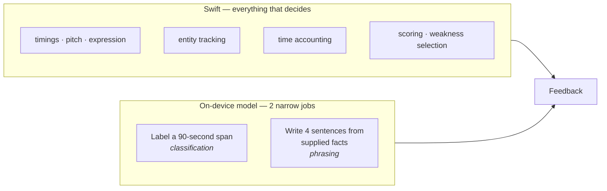
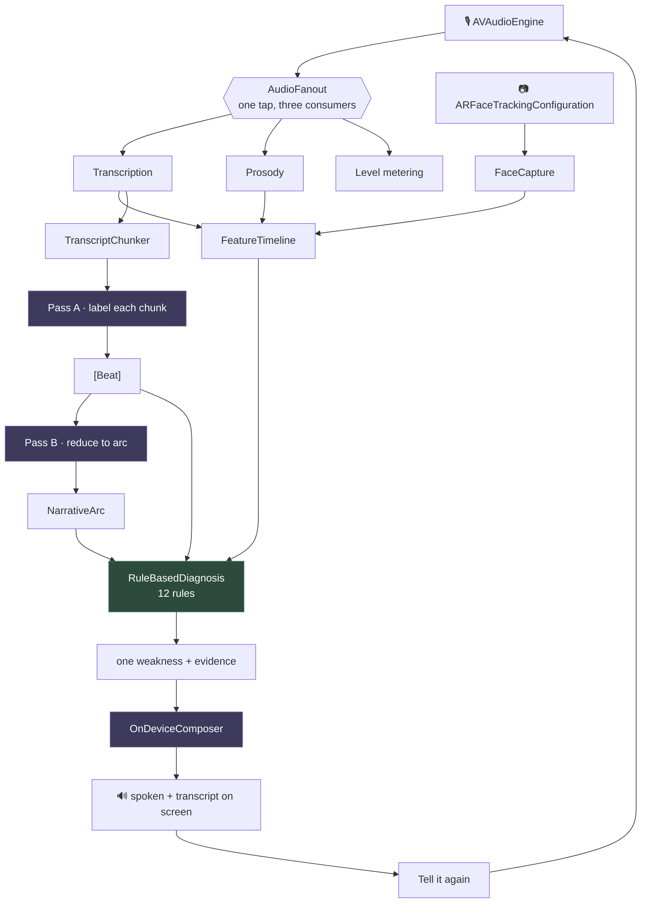
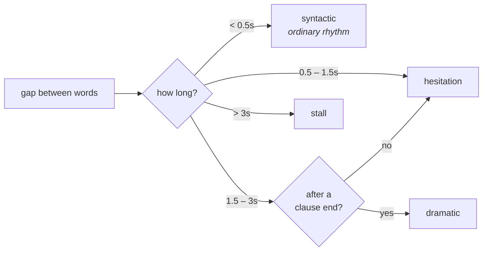
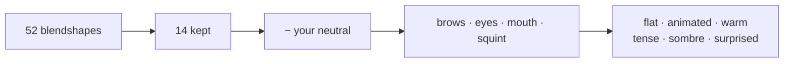
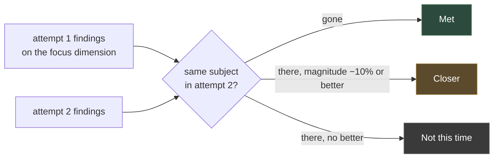

# How the feedback works

You finish a book, open the app, and talk. Nothing is asked of you first — no title, no
picker, no time limit. A few minutes later the app tells you something specific about
how you told it, and points at the moment it means.

This document is how that happens.

---

## The one idea

Everything runs on-device. Apple's on-device model is ~3B parameters with a
**4,096-token budget covering instructions, prompt and response together**. A ten-minute
retelling is ~2,000 tokens of transcript alone, and a model that size cannot judge
narrative quality well even when it fits.

So it never judges anything. The findings come from **deterministic Swift**, and the
model is given only two jobs it is genuinely good at:



"You introduced your brother at 2:14 and never came back to him" *sounds* like model
intelligence. It is a set difference over tracked entities — about ten lines of code.
That reframing is what makes a 3B model sufficient.

---

## The pipeline



Purple is the model. Green is where the findings are actually made.

---

## Stage 1 · Capture

One microphone tap feeds three consumers. `AudioFanout` in
[`Capture/AudioCapture.swift`](Capture/AudioCapture.swift) duplicates every chunk under a
lock, because the tap runs on a realtime audio thread while consumers register from an
actor.

| What | Where | Notes |
|---|---|---|
| `AudioCapture.chunks()` | [Capture/AudioCapture.swift](Capture/AudioCapture.swift) | call once per consumer, before `start` |
| `AudioCapture.start(convertingTo:)` | " | converts to the format `SpeechAnalyzer` asks for |
| `FaceCapture.samples()` | [Capture/FaceCapture.swift](Capture/FaceCapture.swift) | 14 blendshape channels at 10Hz |
| `FaceCapture.previewFrames()` | " | 320px stills at 15fps for the self-view |

**Nothing is recorded — audio or video.** `FaceCapture` reads exactly two things off each
ARKit frame, `blendShapes` and `timestamp`, and the preview is converted, handed to the
view and dropped. Audio buffers are transcribed and analysed as they arrive and are never
written to disk. The transcript is the only thing that outlives the session.

---

## Stage 2 · Signal — pure Swift, no model

`SpeechTranscriber` is configured with `attributeOptions: [.audioTimeRange]`, so every
word arrives with a start and end. That single fact is what makes every later claim
clickable.

```
words:   the   house   was   empty.        │        he      didn't    know
time:  0.10  0.31   0.55  0.70─0.98        │      2.51    2.70     2.94
                                    ╰──── 1.53s gap ────╯
                                    after a clause end → dramatic
```

**`DeliveryAnalyzer.analyze(_:)`** — [Signal/DeliveryAnalyzer.swift](Signal/DeliveryAnalyzer.swift)



Also: words ÷ minutes for pace, filled pauses matched against
`um uh uhm erm hmm mm mhm` (`er` and `ah` are excluded — too often genuine
interjections), and restarts found as repeated 2–4 word n-grams.

**`ProsodyAnalyzer.frame(from:)`** — [Signal/ProsodyAnalyzer.swift](Signal/ProsodyAnalyzer.swift)
Autocorrelation over 70–350 Hz via `vDSP_dotpr`; correlation below `0.3` means unvoiced.
Gives the pitch contour the transcript cannot.

**`ExpressionBaseline` → `ExpressionReader.read(_:)`** — [Signal/](Signal/)
Resting faces differ, so absolute thresholds label one person permanently tense and
another permanently flat. `ExpressionBaseline` learns *your* neutral (falls fast toward
lower readings, rises at `0.002` so a held expression is not absorbed), and the reader
works on **departures from it**:



`jawOpen` is excluded from the stillness gate — speaking holds it open continuously, so
counting it would measure *whether you are talking*, not whether your face is doing
anything.

Everything lands in **`FeatureTimeline`** — [Signal/FeatureTimeline.swift](Signal/FeatureTimeline.swift) —
which exposes `pitchVariation`, `dynamicRange`, `wordsPerMinute(in:)`,
`expressivity(at:)` and `words(in:)` for the rules to query.

---

## Stage 3 · Narrative — the model's first job

**`TranscriptChunker.chunks(of:)`** — [Narrative/TranscriptChunker.swift](Narrative/TranscriptChunker.swift)
splits at pauses ≥ 0.5s once a chunk passes 60s, hard-breaking at 90s.

It will not emit a chunk under **12 words**: a trailing fragment is folded into the chunk
before it, and a retelling that never reaches 12 words produces no chunks at all. This
matters more than it looks — asked to summarise two words, the model does not decline, it
*invents a scene*. The guard is in Swift because the model has no way to refuse.

**Pass A · `OnDeviceNarrativeAnalyzer.label(_:)`** runs **per chunk in a fresh
`LanguageModelSession`**. Sessions accumulate context; a shared one would exhaust the
budget partway through. It runs *during* the retelling, so only the reduce remains when
you stop.

```
┌──── Beat ─────────────────────────────────────┐
│ start / end        2:14 – 3:02                │
│ summary            "argues with his brother"  │
│ kind               corePlot                   │
│ entitiesIntroduced ["brother", "the house"]   │
│ entitiesReferenced ["protagonist"]            │
│ statesStakes       true                       │
│ connectsCausally   true                       │
└───────────────────────────────────────────────┘
```

**Pass B · `arc(from:)`** sees only the numbered summaries — ~400 tokens for ten minutes —
and returns a `NarrativeArc`: shape, components present, climax index, whether sequencing
is followable.

Story shape is classified **first**, and expectations follow from it, so a thematic
retelling is not marked down for lacking a tidy resolution:

| Shape | Expected components |
|---|---|
| `plotDriven` | setting · initiatingEvent · conflict · attempts · consequences · resolution |
| `characterDriven` | setting · initiatingEvent · goal · conflict · consequences |
| `thematic` | setting · conflict · consequences |
| `episodic` | setting · initiatingEvent · attempts |

Defined by `StoryComponent.expected(for:)` in [../Shared/Beat.swift](../Shared/Beat.swift).

---

## Stage 4 · Diagnosis — where the findings come from

No model. Twelve `DiagnosticRule` values in a collection
([Diagnosis/Rules/](Diagnosis/Rules/)), so covering a new failure means adding a type, never
editing a `switch`.


### Saying nothing, on purpose

A dimension only speaks when there is enough to speak about — `canJudge(_:in:)`:

| Dimension | Needs |
|---|---|
| structure, relevance | ≥ 1 beat |
| coherence, engagement | ≥ 2 beats |
| delivery | ≥ 50 words |

Otherwise the band is **`insufficient`** — *"Not enough to tell"*, never `strong`. Without
this, a retelling too short for any rule to fire scored 1.0 everywhere and reported
uniformly strong, reading silence as excellence.

For the same reason a dimension that *did* flag something can never read `strong`: the
band is capped at `developing` whenever findings exist, so the weakness being put in front
of you is not simultaneously described as a strength.

| Rule | Dimension | Fires when | Weight |
|---|---|---|---|
| `MissingComponentsRule` | structure | a component the shape expects is absent | 0.25 each |
| `DroppedThreadRule` | coherence | entity introduced, never referenced again | 0.30 |
| `CausalDensityRule` | coherence | < 40% of beats connect causally (≥3 beats) | 0.30 |
| `SequencingRule` | coherence | Pass B says order is hard to follow | 0.35 |
| `RestartRule` | coherence | > 3 restarts | 0.20 |
| `TimeAllocationRule` | relevance | > 25% of time on lowValue/offTopic | 0.35 |
| `StakesGapRule` | engagement | ≥2 core beats, no beat states stakes | 0.40 |
| `MonotoneRule` | engagement | pitch variation < 0.12 | 0.30 |
| `FlatClimaxRule` | engagement | expressivity < 0.02 at the climax | 0.25 |
| `FilledPauseRule` | delivery | filler rate > 4% (≥50 words) | 0.20 |
| `StallRule` | delivery | > 2 silences over 3s | 0.25 |
| `RushedClimaxRule` | delivery | climax > 1.2× your own average pace | 0.25 |

### Picking the one weakness

`RuleBasedDiagnosis.impact(of:against:)` weights each dimension's gap by importance —
a story that cannot be followed is a bigger problem than one with fillers in it:

```
structure 1.0   coherence 1.0   relevance 0.85   engagement 0.8   delivery 0.6
```

The gap is measured against **your own rolling average** of the last 8 retellings
(`SwiftDataRetellingStore.baseline()`), not against an absolute. So a coherence score
that always sits at 0.7 for you stops being the headline, and the delivery slip that
actually changed becomes the thing worth telling you about.

---

## How long a retelling can be

Bounded at both ends, in `SessionViewModel`:

| | | Why |
|---|---|---|
| **Minimum** | 40 words **and** 20 seconds | Below this there is nothing to analyse. Analysing anyway does not give weak feedback, it gives invented feedback. |
| **Maximum** | 10 minutes | ~20 chunks. Each costs a model session, and Pass B's beat sheet has to fit one 4,096-token budget. |

The last 60 seconds show a warning; at the cap the turn ends itself through
`endCapture()`, which stops the microphone without awaiting the session task it is called
from. Under the minimum, the session reaches `.tooShort` and says so plainly rather than
producing a report.

---

## Stage 5 · Composition — the model's second job

**`OnDeviceComposer.compose(from:history:)`** — [Composition/OnDeviceComposer.swift](Composition/OnDeviceComposer.swift)

The model receives *only* pre-computed observations:

```
What they did: coherence
- brother was introduced at 2:14 and never came up again
- 28% of the time went to detail the story did not turn on…
Last time this was developing.
```

It writes three or four sentences and one challenge. It cannot introduce a claim, because
it is given no raw material to invent from. `TemplateComposer` sits underneath as a floor,
so an unavailable model degrades to blunter phrasing rather than nothing.

---

## Stage 6 · The second telling

The loop's whole promise is "retell against this one thing", so something has to check
whether you did — and it cannot be the model's impression, or the app would end up
congratulating people for things they did not do.

**`RetellingComparison.compare(_:with:challenge:)`** — [Diagnosis/RetellingComparison.swift](Diagnosis/RetellingComparison.swift)

Findings carry a `subject` (an entity name, or the name of the failure) and a `magnitude`
(**lower is always better**). Observations mention timestamps and counts so they read
differently every time; the subject is what stays constant, and it is what makes two
attempts comparable at all.



Three states rather than two, because a boolean lies about a graded thing. Padding going
**28% → 20%** is real progress; a threshold test would render it as failure, and a
rounding difference either side of 25% would flip the answer entirely.

The verdict then leads the composer's brief, with explicit instruction never to
contradict it. The model phrases the outcome; it does not decide it.

| What attempt 2 passes to a model | |
|---|---|
| Pass A / Pass B | **nothing** — deliberately blind, so it cannot be primed to see improvement that is not there |
| Composer | the challenge, the verdict, and the resolved / still-there / new findings |

---

## Where this comes from

Some of what follows is taken from narrative and fluency research. Some of it I made up.
Those are different things, and the difference matters — a threshold with a paper behind it
can be defended, and one without it can only be tuned until it feels right.

Three tiers, used consistently below:

| | Means |
|:--:|---|
| **● grounded** | Taken from a named framework. The categories, not just the idea. |
| **◐ inspired** | The concept comes from the literature; the implementation is ours and is cruder than the source. |
| **○ invented** | Mine. No research behind it. Tune freely. |

### At a glance

| Dimension | Tier | Chiefly from |
|---|:--:|---|
| **Structure** | ● | Stein & Glenn story grammar · Labov |
| **Delivery** | ● | Speed / breakdown / repair fluency |
| **Coherence** | ◐ | Causal network theory · entity-based coherence |
| **Engagement** | ◐ | Labov's *evaluation* — but see the weakness below |
| **Relevance** | ○ | Nothing. The weakest link in the system. |

---

### Structure ●

`StoryComponent` in [../Shared/Beat.swift](../Shared/Beat.swift) is close to Stein &
Glenn's episode categories:

| Ours | Source |
|---|---|
| `setting` | Stein & Glenn *setting* · Labov *orientation* |
| `initiatingEvent` | Stein & Glenn *initiating event* · Labov *complicating action* |
| `goal` | Stein & Glenn *internal response / goal* |
| `attempts` | Stein & Glenn *attempt* |
| `consequences` | Stein & Glenn *consequence* |
| `resolution` | Labov *resolution* · Mandler & Johnson *ending* |
| `conflict` | **○ not from story grammar** — dramatic-structure vocabulary, added by us |

Labov's **abstract** and **coda** are not modelled at all.

### Coherence ◐

| Rule | Source | Tier |
|---|---|:--:|
| `CausalDensityRule` | Trabasso & van den Broek — causal connectivity predicts what listeners recall and rate as important | ● |
| `DroppedThreadRule` | Entity-based coherence (Centering Theory; Barzilay & Lapata's entity grid) | ◐ we check introduced-then-never-referenced; the sources model *transition types* between mentions |
| `RestartRule` | Levelt, self-repair | ● |
| `SequencingRule` | Labov's temporal-ordering requirement | ◐ reduced to one boolean from the model |

### Relevance ○

`SpanKind` (`corePlot · context · character · emotional · lowValue · offTopic`) and
`TimeAllocationRule` are **invented**. We made up the taxonomy and ask the model to apply
it, which means the most consequential judgement in the system — what counted as padding —
rests on a 3B model's opinion of narrative value.

### Engagement ◐

`statesStakes` is **Labov's evaluation**: the clauses telling a listener why the story was
worth telling at all. This is the strongest research link in the codebase.

`MonotoneRule` and `FlatClimaxRule` are **○ invented**. Prosodic expressiveness has a
literature; we did not operationalise from it.

### Delivery ●

The three delivery rules map onto the **speed / breakdown / repair** fluency triad:

```
speed      → wordsPerMinute
breakdown  → StallRule · pause inventory
repair     → RestartRule · FilledPauseRule
```

The mid-clause versus clause-boundary pause distinction in `DeliveryAnalyzer` comes from
the same literature.

### Everything else ○

`StoryShape`, `ConveyedImpression`, every numeric threshold, the importance weights, and
the band boundaries. `ConveyedImpression` deliberately avoids mapping to Ekman's basic
emotions, though the ARKit blendshapes underneath it correspond to FACS action units.

---

### Two known weaknesses

**1 · Labov's evaluation is badly underweighted.** He treated evaluation as the thing that
separates a story from a report, and as *distributed throughout* a narrative rather than
located in one place. We reduce it to a single `statesStakes` boolean per beat, and
`StakesGapRule` fires only when **no** beat has stakes at all — so a twelve-minute
retelling that states stakes once, anywhere, passes clean. The gap between how central the
research considers this and how coarsely we measure it is the largest in the system.

**2 · Relevance should be derived, not labelled.** The literature already defines narrative
importance without needing an opinion: **membership in the causal chain**. Events on the
chain are recalled more and judged more important. We already extract `connectsCausally`
per beat, so `lowValue` could be *computed* from causal-chain membership instead of asked
for — which would move relevance from ○ to ●, and make it the best-grounded dimension
rather than the worst.

### References

- Labov & Waletzky (1967), *Narrative Analysis: Oral Versions of Personal Experience*; Labov (1972), *Language in the Inner City*
- Stein & Glenn (1979), *An Analysis of Story Comprehension in Elementary School Children*
- Mandler & Johnson (1977), *Remembrance of Things Parsed: Story Structure and Recall*
- Trabasso & van den Broek (1985), *Causal Thinking and the Representation of Narrative Events*
- Grosz, Joshi & Weinstein (1995), *Centering: A Framework for Modeling the Local Coherence of Discourse*
- Barzilay & Lapata (2008), *Modeling Local Coherence: An Entity-Based Approach*
- Levelt (1983), *Monitoring and Self-Repair in Speech*
- Segalowitz (2010), *Cognitive Bases of Second Language Fluency*; Skehan on speed/breakdown/repair fluency
- Ekman & Friesen (1978), *Facial Action Coding System*
- Barrett et al. (2019), *Emotional Expressions Reconsidered* — why `ConveyedImpression` describes what a face conveys rather than what it feels

---

## Why the same recording always gives the same answer

If attempt 2 is better but scores lower because the model sampled differently, the
comparison is worthless and trust is gone permanently. So:

- Every finding, score, band and focus comes from **pure functions over value types**.
- Both model passes run **`GenerationOptions(sampling: .greedy)`** — labels are reproducible too.
- Bands, not 0–100. The measurement is not precise enough to justify two significant figures.

Verified by `theSameRetellingAlwaysDiagnosesIdentically()` in
[../../ConteurTests/RuleBasedDiagnosisTests.swift](../../ConteurTests/RuleBasedDiagnosisTests.swift).

---

## Adding a rule

```swift
struct MyRule: DiagnosticRule {
    let dimension = Dimension.coherence

    /// Whether there was enough to look at. Returning false makes the dimension report
    /// "not enough to tell" rather than strength — say so honestly, because a rule that
    /// could not run is not a rule that found nothing wrong.
    func canEvaluate(in input: DiagnosticInput) -> Bool {
        input.narrative.beats.count >= 2
    }

    func findings(in input: DiagnosticInput) -> [Finding] {
        [
            Finding(
                dimension: dimension,
                // Constant across attempts — this is how a second telling is compared
                // with a first, so it must not contain a timestamp or a count.
                subject: "what-went-wrong",
                // Stated as fact, not advice. The wording the user sees is composed later.
                observation: "…",
                // How much of the problem there is. Lower is always better, so the same
                // problem reduced can be told from the same problem unchanged.
                magnitude: 1,
                weight: 0.3,
                evidence: [Evidence(at: 0, quote: "…", measure: nil)]
            )
        ]
    }
}
```

Add it to `RuleBasedDiagnosis.standardRules`. Nothing else changes.

If the rule comes from a framework, note which one — [Where this comes from](#where-this-comes-from)
tracks that, and a rule with a paper behind it can be defended where an invented threshold
can only be tuned.

**Every finding must carry evidence.** Each `Evidence` holds a timestamp and the words it
came from, and the feedback view scrolls to that passage in the transcript when a finding
is tapped. A claim the speaker cannot go and check is a bug, not a feature — it is the
difference between a receipt and an opinion.
