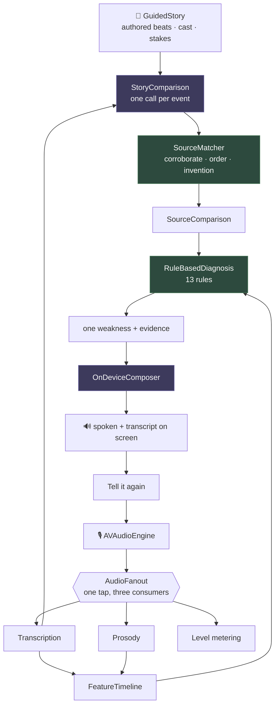
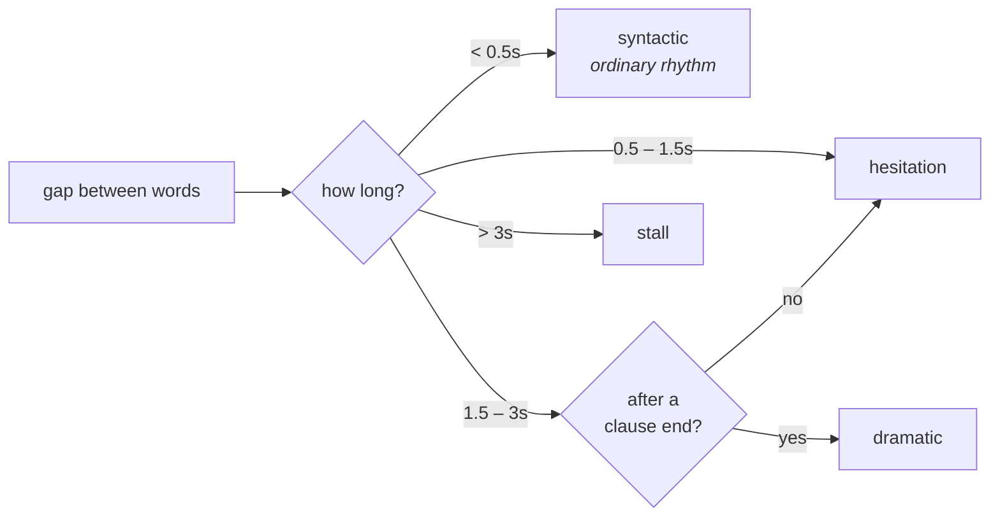
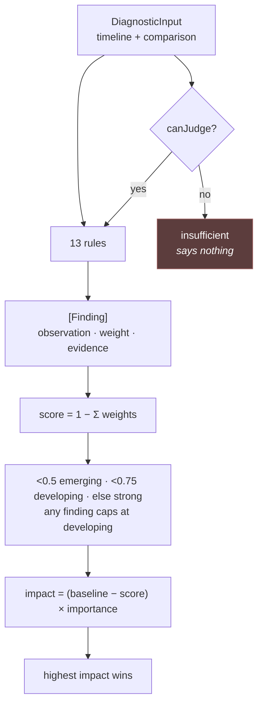
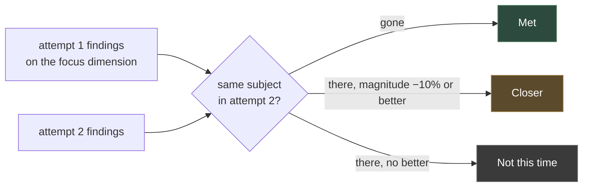

# How the feedback works

You finish a book, open the app, and talk. Nothing is asked of you first — no title, no
picker, no time limit. A few minutes later the app tells you something specific about
how you told it, and points at the moment it means.

This document is how that happens.

---

## The one idea

Everything runs on-device. Apple's on-device model is ~3B parameters with a
**4,096-token budget covering instructions, prompt and response together**. A ten-minute
retelling is ~2,000 tokens of transcript alone, and a model that size cannot judge
narrative quality well even when it fits.

So it never judges anything. The findings come from **deterministic Swift**, and the
model is given only two jobs it is genuinely good at:


"You introduced your brother at 2:14 and never came back to him" *sounds* like model
intelligence. It is a set difference over tracked entities — about ten lines of code.
That reframing is what makes a 3B model sufficient.

---

## The pipeline



Purple is the model. Green is where the findings are actually made.

---

## Stage 1 · Capture

One microphone tap feeds three consumers. `AudioFanout` in
[`Capture/AudioCapture.swift`](Capture/AudioCapture.swift) duplicates every chunk under a
lock, because the tap runs on a realtime audio thread while consumers register from an
actor.

| What | Where | Notes |
|---|---|---|
| `AudioCapture.chunks()` | [Capture/AudioCapture.swift](Capture/AudioCapture.swift) | call once per consumer, before `start` |
| `AudioCapture.start(convertingTo:)` | " | converts to the format `SpeechAnalyzer` asks for |

**Nothing is recorded.** Audio buffers are transcribed and analysed as they arrive and are
never written to disk. The transcript is the only thing that outlives the session.

---

## Stage 2 · Signal — pure Swift, no model

`SpeechTranscriber` is configured with `attributeOptions: [.audioTimeRange]`, so every
word arrives with a start and end. That single fact is what makes every later claim
clickable.

```
words:   the   house   was   empty.        │        he      didn't    know
time:  0.10  0.31   0.55  0.70─0.98        │      2.51    2.70     2.94
                                    ╰──── 1.53s gap ────╯
                                    after a clause end → dramatic
```

**`DeliveryAnalyzer.analyze(_:)`** — [Signal/DeliveryAnalyzer.swift](Signal/DeliveryAnalyzer.swift)



Also: words ÷ minutes for pace, filled pauses matched against
`um uh uhm erm hmm mm mhm` (`er` and `ah` are excluded — too often genuine
interjections), and restarts found as repeated 2–4 word n-grams.

**`ProsodyAnalyzer.frame(from:)`** — [Signal/ProsodyAnalyzer.swift](Signal/ProsodyAnalyzer.swift)
Autocorrelation over 70–350 Hz via `vDSP_dotpr`; correlation below `0.3` means unvoiced.
Gives the pitch contour the transcript cannot.

Everything lands in **`FeatureTimeline`** — [Signal/FeatureTimeline.swift](Signal/FeatureTimeline.swift) —
which exposes `pitchVariation`, `dynamicRange`, `wordsPerMinute(in:)` and `words(in:)`
for the rules to query.

---

## Stage 3 · Comparison — the model's one judgement call

The app chose the story, so the answers are already known. That is what makes this stage
small: **only one question needs a model at all** — did this retelling cover this event? —
and everything else is measured in Swift against the authored beats.

**`StoryComparison.compare(_:with:)`** — [Comparison/StoryComparison.swift](Comparison/StoryComparison.swift)
asks that question **once per event**, each in a fresh `LanguageModelSession`, bounded to
three at a time. Asked about several events in one prompt the model answers per batch
rather than per event: on every commentary sample it credited exactly the first batch of
three and nothing after it, which is position rather than judgement.

```
┌──── CoverageDraft ─────────────────────────────┐
│ covered   true                                 │
│ quote     "she found the letters in the desk"   │
└────────────────────────────────────────────────┘
```

A refused event is left **unresolved** rather than reported as an omission — the guardrail
refuses individual events unpredictably, and blaming the speaker for that is the one thing
this stage must not do. Only a comparison where nothing at all was judged fails.

**`SourceMatcher`** — [Comparison/SourceMatcher.swift](Comparison/SourceMatcher.swift) —
then rules on what the model said, and computes everything it was never asked:

| What | How |
|---|---|
| `corroborates(_:_:in:)` | an event's summary uses words no other event's does; at least one has to be in the retelling |
| `vocabularyOverlap(_:_:in:)` | how many of them are, so strong evidence can overrule a denial |
| `mentions(_:)` | a name counts as said allowing a determiner and a plural, and nothing looser |
| `entities(in:from:)` | which of the cast were named, matched on whole words |
| `inventedNames(in:from:)` | capitalised, not sentence-initial, absent from the story |
| `orderAccuracy(of:)` | concordant pairs over located coverage |

Both directions of that first check earned their place the hard way. Requiring a
distinctive *name* as well threw out eight real coverages out of nine misses; requiring
nothing credited commentary with events it never told.

The result is a **`SourceComparison`**: covered, omitted, unresolved, rejected, which of
the cast were named, which names were invented, order accuracy, compression, and whether
the point came through.

---

## Stage 4 · Diagnosis — where the findings come from

No model. Twelve `DiagnosticRule` values in a collection
([Diagnosis/Rules/](Diagnosis/Rules/)), so covering a new failure means adding a type, never
editing a `switch`.



### Saying nothing, on purpose

A dimension only speaks when there is enough to speak about — `canJudge(_:in:)`:

| Dimension | Needs |
|---|---|
| structure, relevance | ≥ 1 beat |
| coherence, engagement | ≥ 2 beats |
| delivery | ≥ 50 words |

Otherwise the band is **`insufficient`** — *"Not enough to tell"*, never `strong`. Without
this, a retelling too short for any rule to fire scored 1.0 everywhere and reported
uniformly strong, reading silence as excellence.

For the same reason a dimension that *did* flag something can never read `strong`: the
band is capped at `developing` whenever findings exist, so the weakness being put in front
of you is not simultaneously described as a strength.

| Rule | Dimension | Fires when | Weight |
|---|---|---|---|
| `OmittedEventRule` | structure | a load-bearing event never came through | 0.15 each, +0.25 if it was the climax |
| `OmittedCharacterRule` | coherence | a central character was never named | 0.30 |
| `SequenceAccuracyRule` | coherence | order accuracy below 0.85 | 0.30 |
| `UncausedEventRule` | coherence | an event told without the event that caused it | 0.25 |
| `RestartRule` | coherence | > 3 restarts | 0.20 |
| `CompressionRule` | relevance | skeletal (0.30) or padded (0.25) against expected recall | 0.30 / 0.25 |
| `StakesRule` | engagement | the point of the story never came through | 0.40 |
| `MonotoneRule` | engagement | pitch variation < 0.12 | 0.30 |
| `InventionRule` | fidelity | a name the story never had | 0.35 |
| `CoverageRule` | fidelity | under half the load-bearing events told | 0.30, or 0.50 if nothing was narrated |
| `FilledPauseRule` | delivery | filler rate > 4% (≥50 words) | 0.20 |
| `StallRule` | delivery | > 2 silences over 3s | 0.25 |
| `RushedClimaxRule` | delivery | climax > 1.2× your own average pace | 0.25 |

Every rule reads `SourceComparison` or `FeatureTimeline` and nothing else. None of them
consults the model, which is what makes the same recording always score the same.

### Picking the one weakness

`RuleBasedDiagnosis.impact(of:against:)` weights each dimension's gap by importance —
a story that cannot be followed is a bigger problem than one with fillers in it:

```
structure 1.0   coherence 1.0   relevance 0.85   engagement 0.8   delivery 0.6
```

The gap is measured against **your own rolling average** of the last 8 retellings
(`SwiftDataRetellingStore.baseline()`), not against an absolute. So a coherence score
that always sits at 0.7 for you stops being the headline, and the delivery slip that
actually changed becomes the thing worth telling you about.

---

## How long a retelling can be

Bounded at both ends, in `SessionViewModel`:

| | | Why |
|---|---|---|
| **Minimum** | 40 words **and** 20 seconds | Below this there is nothing to analyse. Analysing anyway does not give weak feedback, it gives invented feedback. |
| **Maximum** | 3 minutes | One model call per event, and a 350-word story's beat sheet plus a retelling has to fit one 4,096-token budget. |

The last 60 seconds show a warning; at the cap the turn ends itself through
`endCapture()`, which stops the microphone without awaiting the session task it is called
from. Under the minimum, the session reaches `.tooShort` and says so plainly rather than
producing a report.

---

## Stage 5 · Composition — the model's second job

**`OnDeviceComposer.compose(from:history:)`** — [Composition/OnDeviceComposer.swift](Composition/OnDeviceComposer.swift)

The model receives *only* pre-computed observations:

```
What they did: coherence
- brother was introduced at 2:14 and never came up again
- 28% of the time went to detail the story did not turn on…
Last time this was developing.
```

It writes three or four sentences and one challenge. It cannot introduce a claim, because
it is given no raw material to invent from. `TemplateComposer` sits underneath as a floor,
so an unavailable model degrades to blunter phrasing rather than nothing.

---

## Stage 6 · The second telling

The loop's whole promise is "retell against this one thing", so something has to check
whether you did — and it cannot be the model's impression, or the app would end up
congratulating people for things they did not do.

**`RetellingComparison.compare(_:with:challenge:)`** — [Diagnosis/RetellingComparison.swift](Diagnosis/RetellingComparison.swift)

Findings carry a `subject` (an entity name, or the name of the failure) and a `magnitude`
(**lower is always better**). Observations mention timestamps and counts so they read
differently every time; the subject is what stays constant, and it is what makes two
attempts comparable at all.



Three states rather than two, because a boolean lies about a graded thing. Padding going
**28% → 20%** is real progress; a threshold test would render it as failure, and a
rounding difference either side of 25% would flip the answer entirely.

The verdict then leads the composer's brief, with explicit instruction never to
contradict it. The model phrases the outcome; it does not decide it.

| What attempt 2 passes to a model | |
|---|---|
| `StoryComparison` | **nothing** — deliberately blind, so it cannot be primed to see improvement that is not there |
| Composer | the challenge, the verdict, and the resolved / still-there / new findings |

---

## Where this comes from

Some of what follows is taken from narrative and fluency research. Some of it I made up.
Those are different things, and the difference matters — a threshold with a paper behind it
can be defended, and one without it can only be tuned until it feels right.

Three tiers, used consistently below:

| | Means |
|:--:|---|
| **● grounded** | Taken from a named framework. The categories, not just the idea. |
| **◐ inspired** | The concept comes from the literature; the implementation is ours and is cruder than the source. |
| **○ invented** | Mine. No research behind it. Tune freely. |

### At a glance

| Dimension | Tier | Chiefly from |
|---|:--:|---|
| **Structure** | ● | Stein & Glenn story grammar · Labov |
| **Delivery** | ● | Speed / breakdown / repair fluency |
| **Coherence** | ◐ | Causal network theory · entity-based coherence |
| **Engagement** | ◐ | Labov's *evaluation* — but see the weakness below |
| **Relevance** | ○ | Nothing. The weakest link in the system. |

---

### Structure ●

`StoryComponent` in [Library/GuidedStory.swift](Library/GuidedStory.swift) is close to Stein &
Glenn's episode categories:

| Ours | Source |
|---|---|
| `setting` | Stein & Glenn *setting* · Labov *orientation* |
| `initiatingEvent` | Stein & Glenn *initiating event* · Labov *complicating action* |
| `goal` | Stein & Glenn *internal response / goal* |
| `attempts` | Stein & Glenn *attempt* |
| `consequences` | Stein & Glenn *consequence* |
| `resolution` | Labov *resolution* · Mandler & Johnson *ending* |
| `conflict` | **○ not from story grammar** — dramatic-structure vocabulary, added by us |

Labov's **abstract** and **coda** are not modelled at all.

### Coherence ◐

| Rule | Source | Tier |
|---|---|:--:|
| `UncausedEventRule` | Trabasso & van den Broek — causal connectivity predicts what listeners recall and rate as important | ● the story's own `causedBy` links, rather than a judgement about them |
| `OmittedCharacterRule` | Entity-based coherence (Centering Theory; Barzilay & Lapata's entity grid) | ◐ we check whether a central character was named at all; the sources model *transition types* between mentions |
| `RestartRule` | Levelt, self-repair | ● |
| `SequenceAccuracyRule` | Labov's temporal-ordering requirement | ● concordant pairs against the authored order, not an impression of it |

### Relevance ◐

`CompressionRule` measures the retelling's length against what immediate recall of a story
this length would be expected to run to — **Brysbaert's** reading rate and the recall
ratios below. That is a real basis for "too thin" and "padded", where the taxonomy this
replaced asked the model to rule on what counted as narrative value.

What it does *not* do is say which parts were padding. Length is measurable; worth is not.

### Engagement ◐

`StakesRule` is **Labov's evaluation**: the clauses telling a listener why the story was
worth telling at all. This is the strongest research link in the codebase. The story's own
`stakes` line is authored, and the model has to quote the words that carried it — a quote
that is not in the retelling is not evidence of anything.

`MonotoneRule` is **○ invented**. Prosodic expressiveness has a
literature; we did not operationalise from it.

### Delivery ●

The three delivery rules map onto the **speed / breakdown / repair** fluency triad:

```
speed      → wordsPerMinute
breakdown  → StallRule · pause inventory
repair     → RestartRule · FilledPauseRule
```

The mid-clause versus clause-boundary pause distinction in `DeliveryAnalyzer` comes from
the same literature.

### Everything else ○

Every numeric threshold, the importance weights, and the band boundaries.

---

### Two known weaknesses

**1 · Labov's evaluation is badly underweighted.** He treated evaluation as the thing that
separates a story from a report, and as *distributed throughout* a narrative rather than
located in one place. We reduce it to one authored `stakes` line per story, and
`StakesRule` fires only when it never came through at all — so a retelling that lands the
point once, anywhere, passes clean. The gap between how central the research considers this
and how coarsely we measure it is the largest in the system.

**2 · Nothing measures which parts were worth telling.** `CompressionRule` rules on
*length*, and the literature defines narrative importance without needing an opinion:
**membership in the causal chain**. Events on the chain are recalled more and judged more
important. The stories already author `causedBy` links, so which of the events a reteller
spent their time on could be weighted by causal-chain membership — the one measurement
that would let the app say a retelling was long in the wrong places rather than only that
it was long.

### References

- Labov & Waletzky (1967), *Narrative Analysis: Oral Versions of Personal Experience*; Labov (1972), *Language in the Inner City*
- Stein & Glenn (1979), *An Analysis of Story Comprehension in Elementary School Children*
- Mandler & Johnson (1977), *Remembrance of Things Parsed: Story Structure and Recall*
- Trabasso & van den Broek (1985), *Causal Thinking and the Representation of Narrative Events*
- Grosz, Joshi & Weinstein (1995), *Centering: A Framework for Modeling the Local Coherence of Discourse*
- Barzilay & Lapata (2008), *Modeling Local Coherence: An Entity-Based Approach*
- Levelt (1983), *Monitoring and Self-Repair in Speech*
- Segalowitz (2010), *Cognitive Bases of Second Language Fluency*; Skehan on speed/breakdown/repair fluency

---

## Why the same recording always gives the same answer

If attempt 2 is better but scores lower because the model sampled differently, the
comparison is worthless and trust is gone permanently. So:

- Every finding, score, band and focus comes from **pure functions over value types**.
- Both model passes run **`GenerationOptions(sampling: .greedy)`** — labels are reproducible too.
- Bands, not 0–100. The measurement is not precise enough to justify two significant figures.

Verified by `theSameRetellingAlwaysDiagnosesIdentically()` in
[../../ConteurTests/RuleBasedDiagnosisTests.swift](../../ConteurTests/RuleBasedDiagnosisTests.swift).

---

## Adding a rule

```swift
struct MyRule: DiagnosticRule {
    let dimension = Dimension.coherence

    /// Whether there was enough to look at. Returning false makes the dimension report
    /// "not enough to tell" rather than strength — say so honestly, because a rule that
    /// could not run is not a rule that found nothing wrong.
    func canEvaluate(in input: DiagnosticInput) -> Bool {
        input.narrative.beats.count >= 2
    }

    func findings(in input: DiagnosticInput) -> [Finding] {
        [
            Finding(
                dimension: dimension,
                // Constant across attempts — this is how a second telling is compared
                // with a first, so it must not contain a timestamp or a count.
                subject: "what-went-wrong",
                // Stated as fact, not advice. The wording the user sees is composed later.
                observation: "…",
                // How much of the problem there is. Lower is always better, so the same
                // problem reduced can be told from the same problem unchanged.
                magnitude: 1,
                weight: 0.3,
                evidence: [Evidence(at: 0, quote: "…", measure: nil)]
            )
        ]
    }
}
```

Add it to `RuleBasedDiagnosis.standardRules`. Nothing else changes.

If the rule comes from a framework, note which one — [Where this comes from](#where-this-comes-from)
tracks that, and a rule with a paper behind it can be defended where an invented threshold
can only be tuned.

**Every finding must carry evidence.** Each `Evidence` holds a timestamp and the words it
came from, and the feedback view scrolls to that passage in the transcript when a finding
is tapped. A claim the speaker cannot go and check is a bug, not a feature — it is the
difference between a receipt and an opinion.
